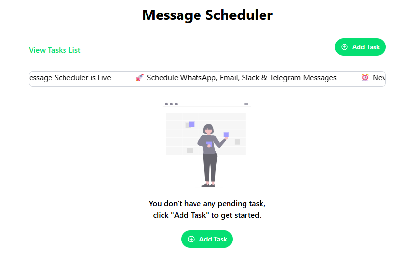
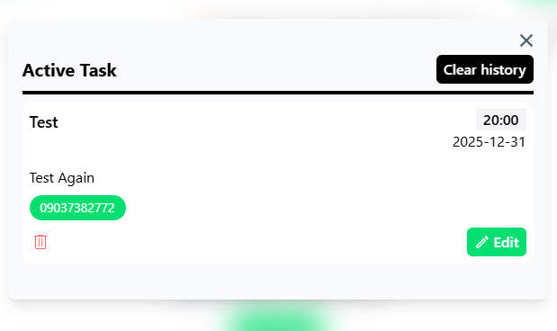
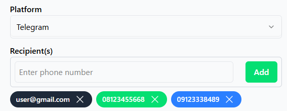
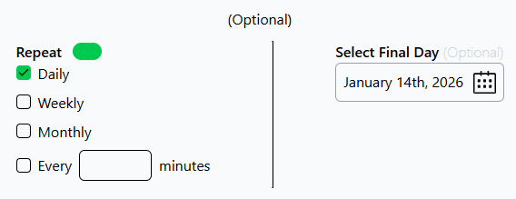
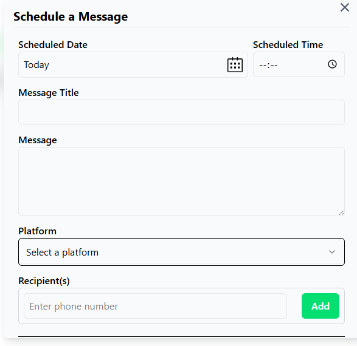

# Message Scheduler

A simple and intuitive web application for scheduling automated messages across multiple platforms: WhatsApp, Email (Gmail), Slack, and Telegram.

Perfect for reminders, birthday wishes, marketing campaigns, or recurring notifications — send messages at the exact date/time you choose, or set them to repeat daily, weekly, monthly, or at custom intervals.

## Features

- **Multi-Platform Support**: Schedule messages for WhatsApp, Gmail, Slack, and Telegram in one place.
- **One-Time or Recurring Schedules**: Send once on a specific date/time or repeat daily, weekly, monthly, or every X minutes.
- **Flexible Recipients**: Add multiple recipients easily (phone numbers for WhatsApp, etc.).
- **Task Management**: View, edit, delete, and monitor active/scheduled tasks.
- **Clean Modal-Based UI**: Add and schedule messages through intuitive dialogs with clear sections for date, time, message content, and platform selection.
- **Live Status Updates**: Real-time feedback on what's new about the web app".

## Tech Stack

- **Frontend**: React + Vite, Tailwind CSS
- **UI Components**: Shadcn UI for beautiful, accessible components (Select, Dialog, Input, Buttons, etc.)
- **State Management**: React hooks
- **Local Storage**: Use local storage to serve as a temporary database.

## Screenshots

  
*Empty state with "Add Task" and "View Task List" prompt*

  
*View and manage running/scheduled tasks*

  
*Select platform and add recipients*

  
*Configure recurrence and final day*

  
.png)
*Full message composition modal*

## Installation & Setup (Local Development)

1. Clone the repo:
   ```bash
   git clone https://github.com/TaslimYusuf2210/MessageScheduler.git

2. Install dependencies:
Bash
npm install
# or yarn / pnpm

3. Run the development server:
Bash
npm run dev

4. Open http://localhost:3000